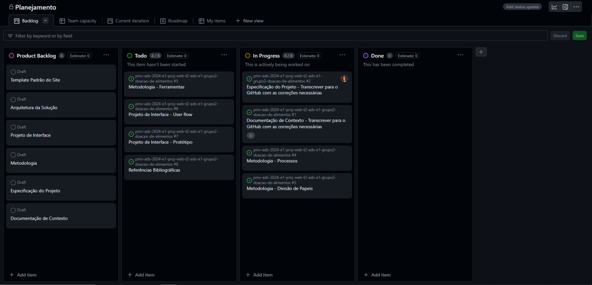
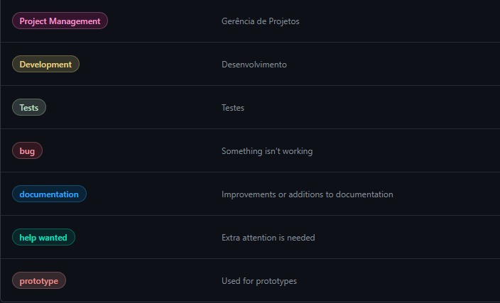

# Metodologia

## Gerenciamento de Projeto

A metodologia escolhida para o gerenciamento e desenvolvimento deste projeto foi a ágil. Dentre as metodologias ágeis existentes no mercado, escolhemos a mais usada atualmente que é o SCRUM.
Foi escolhida essa metodologia pois, as práticas do Scrum permitem que as equipes promovam o autogerenciamento, aprendam com base nas experiências e se adaptem às mudanças.
Além de solucionar problemas complexos de maneira econômica e sustentavel.

### Divisão de Papéis

A divisão de papéis do grupo baseada na divisão do SCRUM(Scrum Master, Product Owner e Equipe de Desenvolvimento) ficou da seguinte forma:
<ul>
<li>Scrum Master: Rodrigo Amorim;</li>
<li>Product Owner: Danilo Oliveira;</li>
<li>Equipe de Desenvolvimento: Rodrigo Amorim, Fabio Luiz, Laise Farias France,Italo de Souza Pereira, Ana Zschaber, Danilo Oliveira e César Ribeiro.</li>
</ul>

### Processo

Para organização e distribuição das tarefas do projeto, a equipe está utilizando o GitHub, estruturado com as seguintes listas:
<ul>
<li>Product Backlog: recebe as tarefas a serem trabalhadas e representa o Backlog do produto. Todas as atividades identificadas no decorrer do projeto são incorporadas a esta lista. </li>
<li>To do: esta lista representa o Sprint Backlog que está sendo trabalhado.</li>
<li>In progress: lista das tarefas iniciadas.</li>
<li>Done: nesta lista são colocadas as tarefas finalizadas.</li>
</ul>

O quadro kanban do grupo no GitHub está presente no link: https://github.com/orgs/ICEI-PUC-Minas-PMV-ADS/projects/963/views/1 e esta apresentado no estado atual da seguinte forma:
<figure>
    
    <figcaption> Figura 1 - Tela do kanban do GitHub utilizada pelo grupo</figcaption>
</figure>

### Etiquetas

As tarefas são, ainda, etiquetadas em função da natureza da atividade e seguem o seguinte esquema de cores/categorias:

<ul>
  <li>Bug (Erro no código)</li>
  <li>Desenvolvimento (Development)</li>
  <li>Documentação (Documentation)</li>
  <li>Gerência de Projetos (Project Management)</li>
  <li>Atenção Extra (Help Wanted)</li>
  <li>Prototipo (Prototype)</li>
  <li>Testes (Tests)</li>
</ul>

<figure>
    
    <figcaption> Figura 2 - Tela do esquema de categorias e cores<figcaption>
</figure>

### Ferramentas

As ferramentas empregadas no projeto são:

- Editor de código.
- Ferramentas de comunicação
- Ferramentas de desenho de tela (_wireframing_)

O editor de código foi escolhido porque ele possui uma integração com o sistema de versão. As ferramentas de comunicação utilizadas possuem integração semelhante e por isso foram selecionadas. Por fim, para criar diagramas utilizamos essa ferramenta por melhor captar as necessidades da nossa solução.

Os artefatos do projeto são desenvolvidos a partir das plataformas GitHub apresentadas com seu propósito na tabela que se segue.
| AMBIENTE | PLATAFORMA |LINK DE ACESSO                 |
|--------------------|--------------------------------------------------------------------------------|----------------------------------------|
|Repositório de código fonte | GitHub | https://github.com/ICEI-PUC-Minas-PMV-ADS/pmv-ads-2024-e1-proj-web-t2-ads-e1-grupo2-doacao-de-alimentos/blob/main/README.md  |
|Documentos do projeto  | GitHub | https://github.com/ICEI-PUC-Minas-PMV-ADS/pmv-ads-2024-e1-proj-web-t2-ads-e1-grupo2-doacao-de-alimentos/blob/main/ |
|Gerenciamento do projeto  | GitHub | [https://github.com/orgs/ICEI-PUC-Minas-PMV-ADS/projects/963/views/1](https://github.com/orgs/ICEI-PUC-Minas-PMV-ADS/projects/963) |
