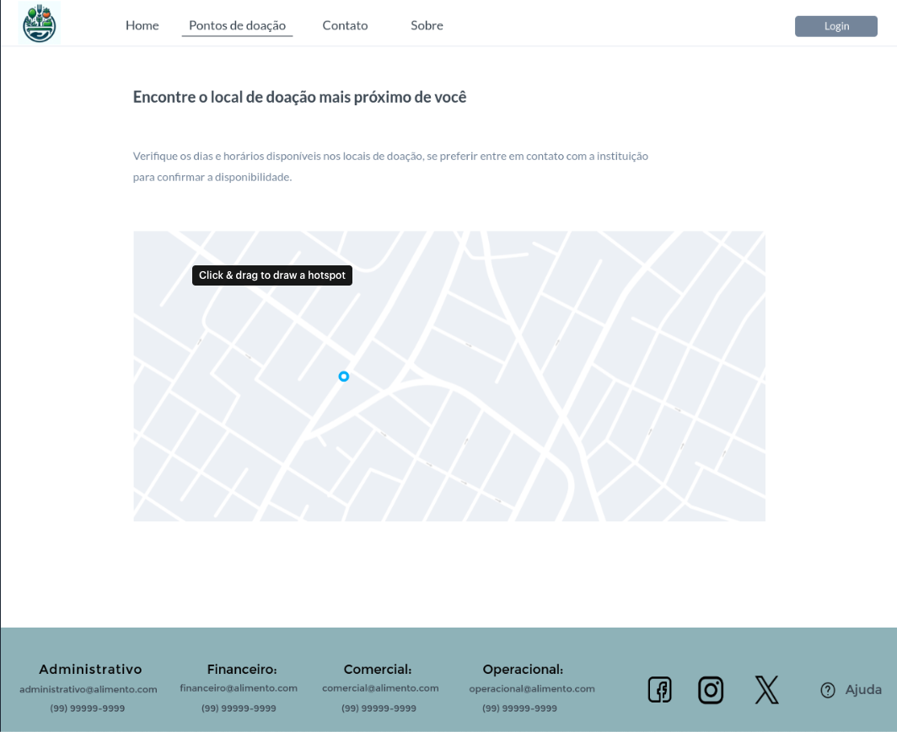
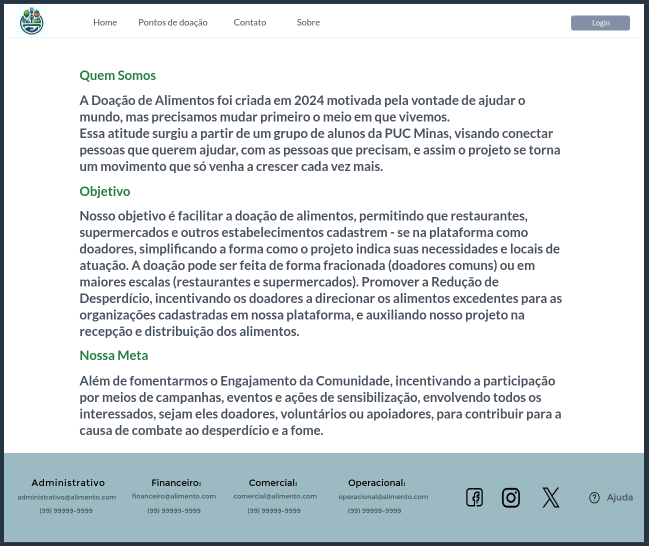
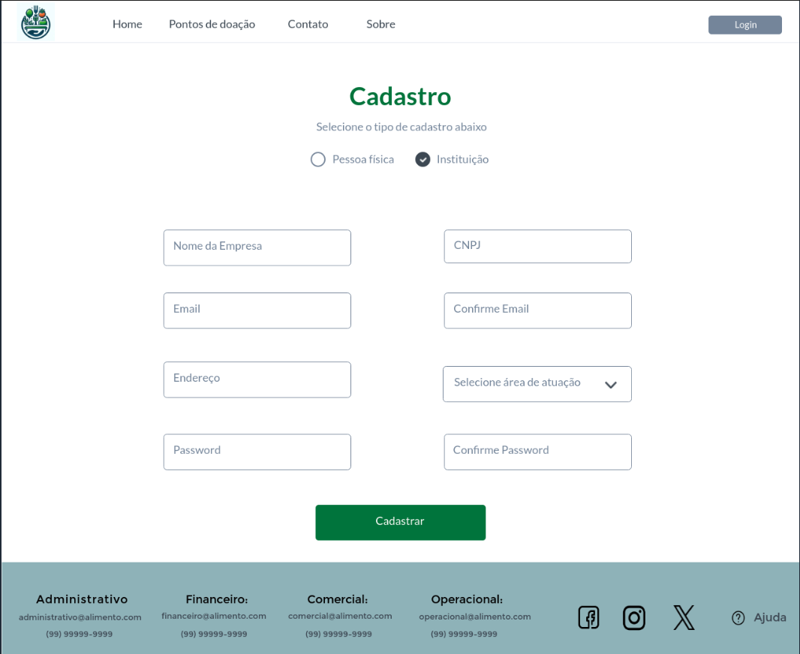

# Projeto de Interface

## User Flow
A Figura 1 ilustra o caminho que o usuário percorre ao interagir com as diversas telas do sistema. Cada tela é detalhada na seção subsequente, intitulada Protótipo de Baixa Fidelidade.

Para uma experiência interativa com o protótipo, visite o projeto .

(ADICIONAR AQUI A TELA Fluxo de telas do usuário)

Figura 1 - Trajetória das telas do usuário

## Protótipo de Baixa Fidelidade

As telas do sistema seguem uma estrutura comum, ilustrada na Figura 2. Esta estrutura é composta por três principais blocos:

- Cabeçalho: aqui se encontram o nome da aplicação web e a navegação principal do site (menu da aplicação);
- Conteúdo: exibe o conteúdo específico de cada tela;
- Rodapé: contém informações sobre os direitos autorais.

Figura 2 - Estrutura padrão do site

---

## Tela - Home Page

A página principal do nosso site de doação de alimentos exibe banners que direcionam os usuários para as páginas de **Home**, **Sobre**, **Cadastro**, **Pontos**. Além disso, apresenta uma descrição sucinta sobre o projeto.

### Cabeçalho com Menu de Navegação

No topo da página, há um menu de navegação com várias opções, incluindo "Home", "Sobre" e outras opções. O logotipo da organização está posicionado no canto superior esquerdo.

### Seção Principal

Esta seção contém uma frase inspiradora - "Um grão de generosidade pode alimentar o mundo", juntamente com um botão chamado “Doar agora”.

### Seção de Conteúdo com Três Blocos

Esta seção é dividida em três blocos, cada um com um título e espaço para texto ou imagem. Os títulos dos blocos são “Ongs e Parceiros”, “Seja um Doador” e “Campanhas de Doações”.

### Mapa Interativo

Abaixo dos blocos de conteúdo, há um mapa interativo que mostra locais marcados, representando pontos de doação.

### Formulário de Consulta

Há uma seção onde os usuários podem consultar pontos de doações. Esta seção inclui um campo para inserir informações e um botão para enviar a consulta.

### Rodapé

Na parte inferior da página, há um rodapé que contém links úteis, informações adicionais e ícones das redes sociais para conectar-se à organização.

Tela da Página do rodapé

Figura 3 - Tela da Página Principal

---

### Tela - Doações

A tela de Doações exibe os alimentos disponíveis para doação, informações detalhadas sobre os alimentos, pontos de retirada e informações de contato.

ADICIONAR AQUI A TELA DE Doações

Figura 4 - Tela de Alimentos para Doações

---

### Página de Doações
Esta página permitirá que os usuários façam doações para as campanhas disponíveis.

Figura 5 - Tela da Página de Doações

---
### Pontos de Doações
A página mostra locais de doações baseado na localização do usuário, assim mostrando as instituições mais próximas a ele.

Tela da Página de Pontos de Doações

---

## Tela - Contato
Esta página será a responsável por conectar os usuários com a insituição, para sanar dúvidas, receber sugestões, entre outros.

### Seção de contatos

Nesta seção de contatos, terá um formulário aonde as pessoas conseguirão registrar seus nomes, e-mails e em que poderíamos ajudá-las, seja em dúvidas, sugestão, etc.

### Rodapé 

No rodapé desta página terão os e-mails dos departamentos responsáveis pela instituição, como por exemplo: Administrativo, Financeiro, Comercial e Operacional. Juntamente, terão os botões das redes sociais que a instituição tem páginas, como por exemplo: Facebook, Instagram e X (Twitter), e logo após terá uma opção de "Ajuda", que servirá para ajudar as pessoas a realizarem o envio para contato.

Figura 6 - Tela da Página para Contato

---

### Criação de Campanhas
Esta página permitirá que os usuários criem suas próprias campanhas de doação.

---

### Sobre a Empresa
Esta página fornecerá informações sobre a empresa, incluindo sua missão, visão e história.

### Tela - Login

A tela de Login solicita que o usuário insira suas credenciais, que são o nome de usuário e a senha. Se o usuário ainda não tiver uma conta, ele pode ser redirecionado para a tela de Cadastro através de um link na tela de Login.

!Login

Figura  - Tela de Login

---

### Tela - Cadastro

Na tela de cadastro o fluxo do usuário se divide em duas partes, primeiro temos o cadastro de instituições com os campos nome da empresa, CNPJ, email, confirmação do email, endereço, área de atuação da instituição, senha e confirmação de senha.
Segundo fluxo é o cadastro de pessoas físicas com os campos nome completo, CPF, email, confirmação de email, CEP, endereço, senha e confirmação de senha.

Essa tela de cadastro também será utilizada para a ação de visualizar e atualizar informações de cadastro dos dois tipos de perfis.

Tela de cadastro de instituição

Tela de cadastro de pessoa física

---
---
# Projeto de Interface

Pré-requisitos: <a href="2-Especificação do Projeto.md"> Documentação de Especificação</a>

Visão geral da interação do usuário pelas telas do sistema e protótipo interativo das telas com as funcionalidades que fazem parte do sistema (wireframes).

 Apresente as principais interfaces da plataforma. Discuta como ela foi elaborada de forma a atender os requisitos funcionais, não funcionais e histórias de usuário abordados nas <a href="2-Especificação do Projeto.md"> Documentação de Especificação</a>.

## Diagrama de Fluxo

O diagrama apresenta o estudo do fluxo de interação do usuário com o sistema interativo e  muitas vezes sem a necessidade do desenho do design das telas da interface. Isso permite que o design das interações seja bem planejado e gere impacto na qualidade no design do wireframe interativo que será desenvolvido logo em seguida.

O diagrama de fluxo pode ser desenvolvido com “boxes” que possuem internamente a indicação dos principais elementos de interface - tais como menus e acessos - e funcionalidades, tais como editar, pesquisar, filtrar, configurar - e a conexão entre esses boxes a partir do processo de interação. Você pode ver mais explicações e exemplos https://www.lucidchart.com/blog/how-to-make-a-user-flow-diagram.

As referências abaixo irão auxiliá-lo na geração do artefato “Diagramas de Fluxo”.

> **Links Úteis**:
> - [Fluxograma online: seis sites para fazer gráfico sem instalar nada | Produtividade | TechTudo](https://www.techtudo.com.br/listas/2019/03/fluxograma-online-seis-sites-para-fazer-grafico-sem-instalar-nada.ghtml)

## Wireframes

São protótipos usados em design de interface para sugerir a estrutura de um site web e seu relacionamentos entre suas páginas. Um wireframe web é uma ilustração semelhante do layout de elementos fundamentais na interface.
 
> **Links Úteis**:
> - [Protótipos vs Wireframes](https://www.nngroup.com/videos/prototypes-vs-wireframes-ux-projects/)
> - [Ferramentas de Wireframes](https://rockcontent.com/blog/wireframes/)
> - [MarvelApp](https://marvelapp.com/developers/documentation/tutorials/)
> - [Figma](https://www.figma.com/)
> - [Adobe XD](https://www.adobe.com/br/products/xd.html#scroll)
> - [Axure](https://www.axure.com/edu) (Licença Educacional)
> - [InvisionApp](https://www.invisionapp.com/) (Licença Educacional)
