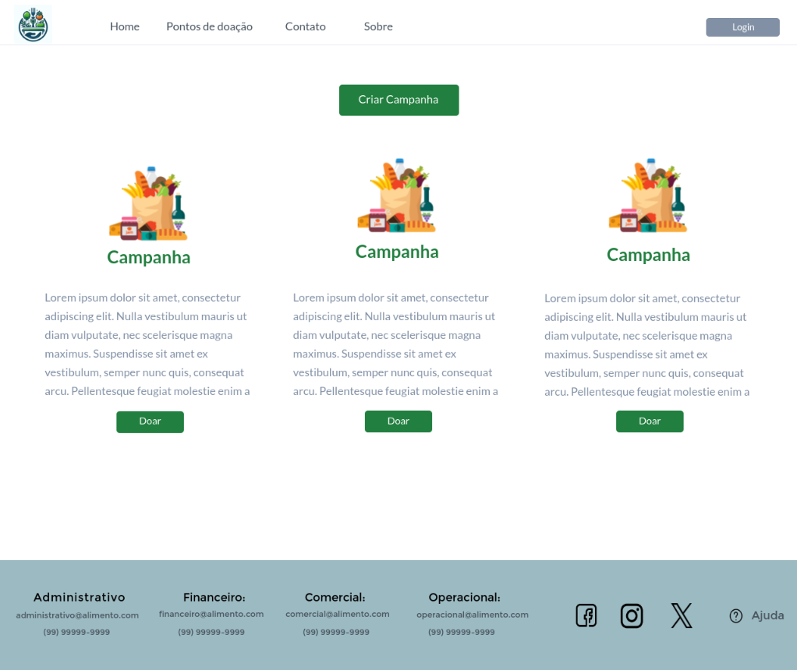
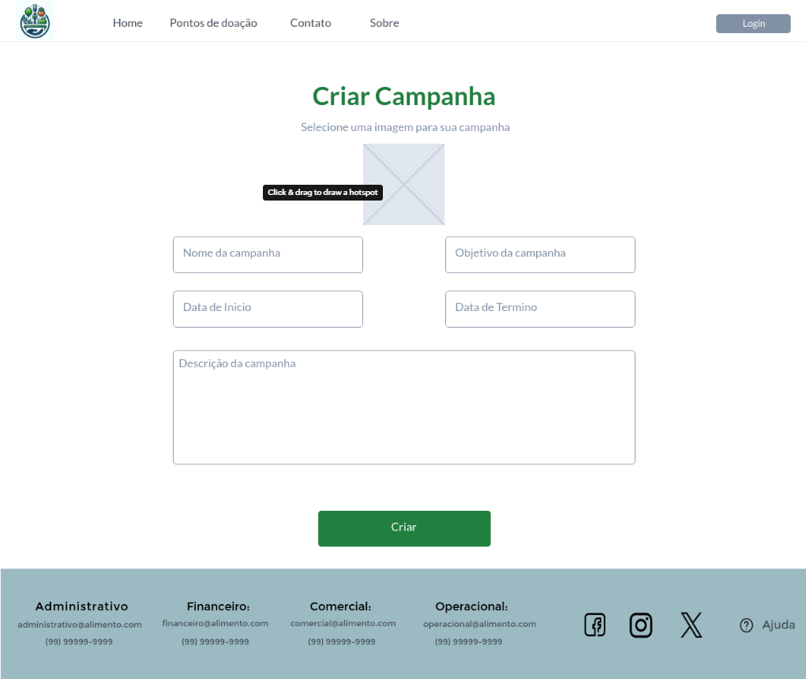
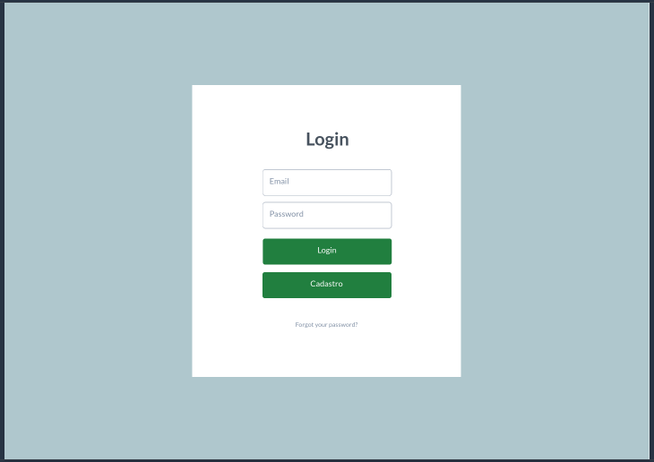

# Projeto de Interface

## User Flow
A Figura 1 ilustra o caminho que o usuário percorre ao interagir com as diversas telas do sistema. Cada tela é detalhada na seção subsequente, intitulada Protótipo de Baixa Fidelidade.

Para uma experiência interativa com o protótipo, visite o projeto .

| Imagem 1 | Imagem 2 | Imagem 3 | Imagem 4 | Imagem 5 |
|:---:|:---:|:---:|:---:|:---:|
|  |  | | | 

| Imagem 6 | Imagem 7 | Imagem 8 | Imagem 9 | Imagem 10 |
|:---:|:---:|:---:|:---:|:---:|
|  | | |  |

Figura 1 - Trajetória das telas do usuário

## Protótipo de Baixa Fidelidade

As telas do sistema seguem uma estrutura comum, ilustrada na Figura 2. Esta estrutura é composta por três principais blocos:

- Cabeçalho: aqui se encontram o nome da aplicação web e a navegação principal do site (menu da aplicação);
- Conteúdo: exibe o conteúdo específico de cada tela;
- Rodapé: contém informações sobre os direitos autorais.

---

## Tela - Home Page

A página principal do nosso site de doação de alimentos exibe banners que direcionam os usuários para as páginas de **Home**, **Sobre**, **Cadastro**, **Pontos**. Além disso, apresenta uma descrição sucinta sobre o projeto.

### Cabeçalho com Menu de Navegação

No topo da página, há um menu de navegação com várias opções, incluindo "Home", "Sobre" e outras opções. O logotipo da organização está posicionado no canto superior esquerdo.

### Seção Principal

Esta seção contém uma frase inspiradora - "Um grão de generosidade pode alimentar o mundo", juntamente com um botão chamado “Doar agora”.

### Seção de Conteúdo com Três Blocos

Esta seção é dividida em três blocos, cada um com um título e espaço para texto ou imagem. Os títulos dos blocos são “Ongs e Parceiros”, “Seja um Doador” e “Campanhas de Doações”.

### Mapa Interativo

Abaixo dos blocos de conteúdo, há um mapa interativo que mostra locais marcados, representando pontos de doação.

### Formulário de Consulta

Há uma seção onde os usuários podem consultar pontos de doações. Esta seção inclui um campo para inserir informações e um botão para enviar a consulta.

### Rodapé

Na parte inferior da página, há um rodapé que contém links úteis, informações adicionais e ícones das redes sociais para conectar-se à organização.

Tela da Página do rodapé

Figura 2 - Tela da Página Principal

---

### Página de Doações
Esta página permitirá que os usuários façam doações para as campanhas disponíveis.

Figura 3 - Tela da Página de Doações

---
### Pontos de Doações
A página mostra locais de doações baseado na localização do usuário, assim mostrando as instituições mais próximas a ele.

Tela da Página de Pontos de Doações

Figura 4 - Tela dos Pontos de Doações

---

## Tela - Contato
Esta página será a responsável por conectar os usuários com a insituição, para sanar dúvidas, receber sugestões, entre outros.

### Seção de contatos

Nesta seção de contatos, terá um formulário aonde as pessoas conseguirão registrar seus nomes, e-mails e em que poderíamos ajudá-las, seja em dúvidas, sugestão, etc.

### Rodapé 

No rodapé desta página terão os e-mails dos departamentos responsáveis pela instituição, como por exemplo: Administrativo, Financeiro, Comercial e Operacional. Juntamente, terão os botões das redes sociais que a instituição tem páginas, como por exemplo: Facebook, Instagram e X (Twitter), e logo após terá uma opção de "Ajuda", que servirá para ajudar as pessoas a realizarem o envio para contato.

Figura 5 - Tela da Página para Contato

---

### Criação de Campanhas
Esta página permitirá que os usuários criem suas próprias campanhas de doação.

Tela de registro na criação de campanha

---

### Sobre a Empresa
Esta página fornecerá informações sobre a empresa, incluindo sua missão, visão e história.

Figura 6 - Tela da Página sobre a empresa

---

### Tela - Login

A tela de Login solicita que o usuário insira suas credenciais, que são o nome de usuário e a senha. Se o usuário ainda não tiver uma conta, ele pode ser redirecionado para a tela de Cadastro através de um link na tela de Login.

!Login

Figura  - Tela de Login

### Tela - Cadastro

Na tela de cadastro o fluxo do usuário se divide em duas partes, primeiro temos o cadastro de instituições com os campos nome da empresa, CNPJ, email, confirmação do email, endereço, área de atuação da instituição, senha e confirmação de senha.
Segundo fluxo é o cadastro de pessoas físicas com os campos nome completo, CPF, email, confirmação de email, CEP, endereço, senha e confirmação de senha.

Essa tela de cadastro também será utilizada para a ação de visualizar e atualizar informações de cadastro dos dois tipos de perfis.

Tela de cadastro de instituição

Tela de cadastro de pessoa física

---
---

