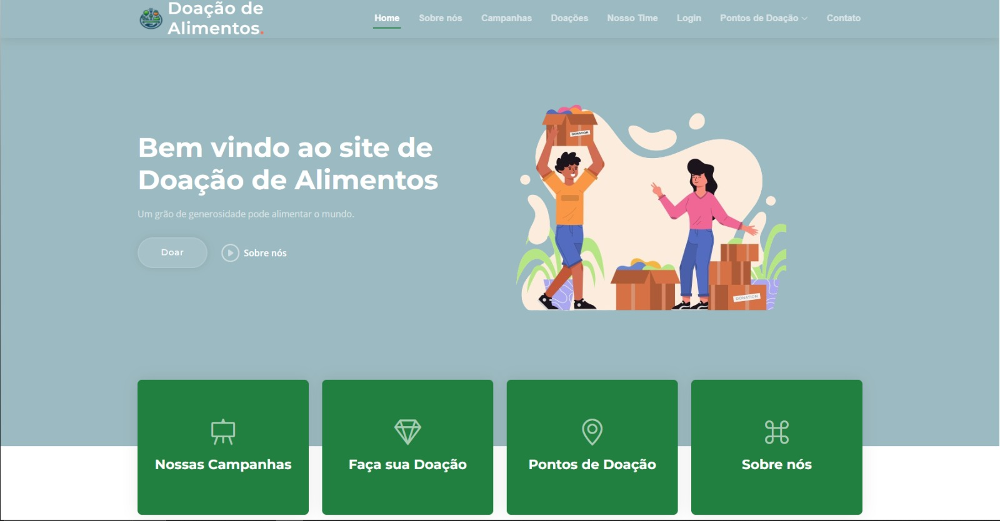

# Template padrão da Aplicação

O layout padrão do site foi construído com as linguagens de marcação HTML  CSS e BOOTSTRAP, e a linguagem de programação JavaScript.

As páginas terão como elementos padrões o menu de navegação, o header e o footer, além dos elementos de identidade visual citados abaixo:

<ul>
<li>Cores: RGB: #f6f8f6, #083871, #9cbac1;</li>
<li>Font-family: montserrat , poppins e sans-serif</li>
<li>Font-size: 15px e 28px.</li>
</ul>
  
O código utilizado para a construção dos elementos citados, incluindo a responsividade, pode ser consultado <a href="https://github.com/ICEI-PUC-Minas-PMV-ADS/pmv-ads-2024-e1-proj-web-t2-ads-e1-grupo2-doacao-de-alimentos/tree/main/codigo-fonte">aqui</a>. As imagens e ícones utilizados no projeto estão disponíveis <a href="https://github.com/ICEI-PUC-Minas-PMV-ADS/pmv-ads-2024-e1-proj-web-t2-ads-e1-grupo2-doacao-de-alimentos/tree/main/docs/img">aqui</a>.

<h3><b>Home</b></h3>

Exibe todas as informações necessarias sobre a doação de alimentos. Desde informação sobre a empresa , itens para doação  e até ações realizadas

<figure> 
  
  <figcaption> Figura 1 - Home page
</figure> 

  

Para a criação do logotipo do site foi utilizada as cores verde , laranja e azul, pois são cores que remetem a conscientização e apresentam bom contraste entre si.

<figure> 
  
    <figcaption>Figura 2 - Logotipo da aplicação web de Doação de Alimentos
</figure> 