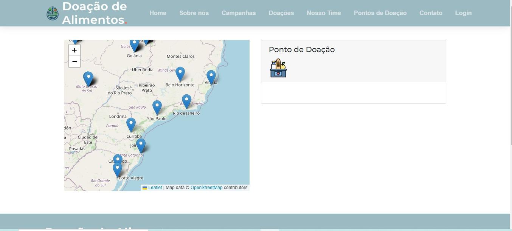
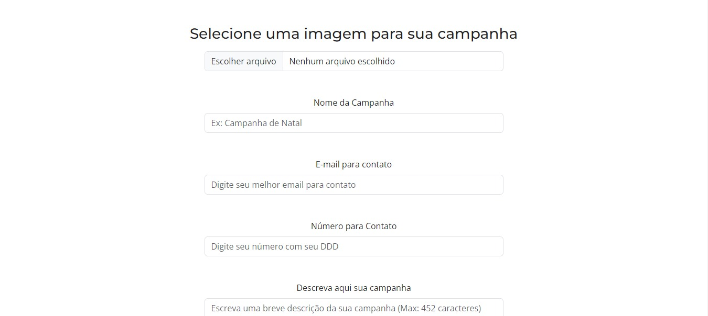
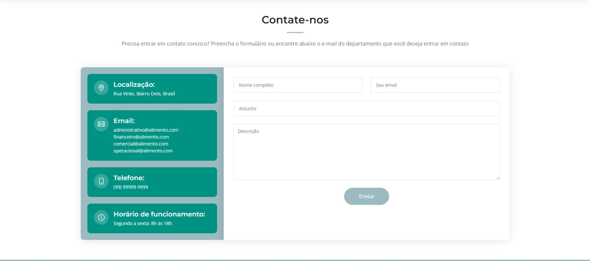
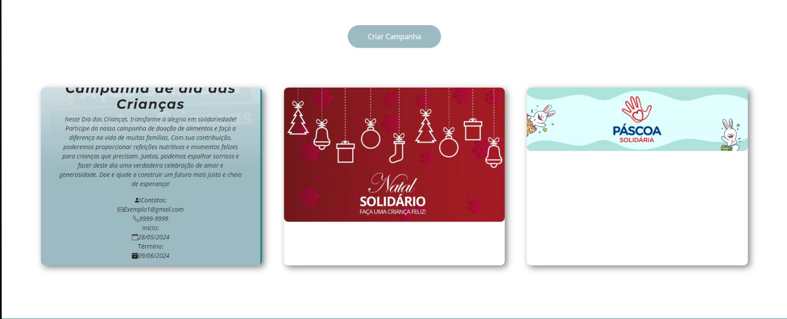
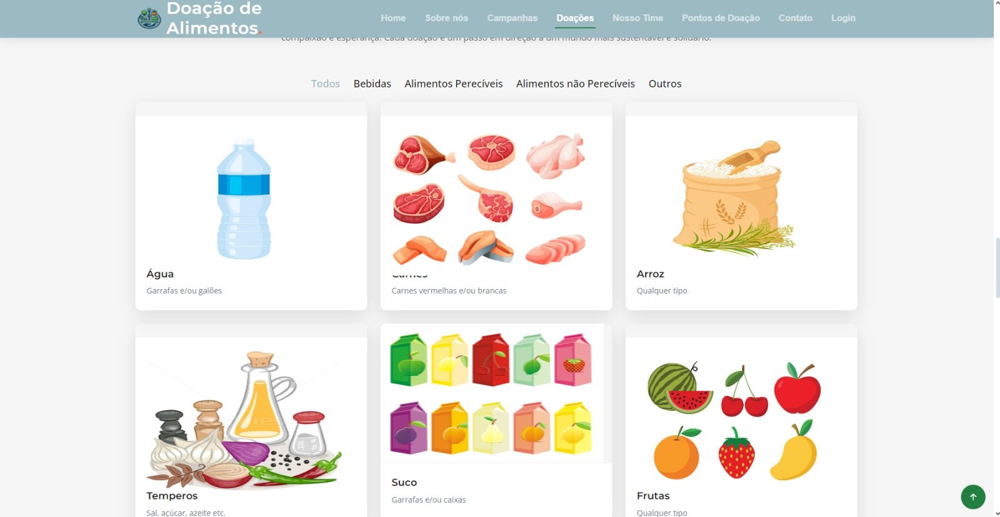

# Programação de Funcionalidades

### Tela de Cadastro (RF-01)

Responsável: Ítalo.

O acesso a tela de cadastro poderá ser feito através da opção na barra de navegação "Login" e depois em "Cadastro". As estruturas de dados foram baseadas em HTML, CSS , BOOTSTRAP e JS.

Exemplo da Tela de Cadastro:
<figure> 
  
  <figcaption> Figura 1 - Exemplo de Cadastro
</figure> 

#### Requisito atendido

RF-01: A aplicação deve permitir ao usuário cadastrar uma conta.

#### Artefatos da funcionalidade

●cadastro.html

●cadastro.js

●style.css

●main.css

●main.js

### Estrutura de Dados

●[cadastro.html](https://github.com/ICEI-PUC-Minas-PMV-ADS/pmv-ads-2024-e1-proj-web-t2-ads-e1-grupo2-doacao-de-alimentos/blob/main/codigo-fonte/cadastro/cadastro.html)

### Instruções de Acesso

Abra a URL da página em seu navegador. Ao clicar em "Login" no canto superior direito, irá abrir uma nova página onde você deve clicar no botão "cadastro" na página e será redirecionado para a página de cadastro.

### Tela de Login (RF-02)

Responsável: Ítalo.

O acesso a tela de login poderá ser feito através da opção na barra de navegação "Login". As estruturas de dados foram baseadas em HTML, CSS , BOOTSTRAP e JS.

Exemplo da Tela de Login:
<figure> 
  
  <figcaption> Figura 2 - Exemplo de Login
</figure> 

#### Requisito atendido

RF-02: A aplicação deve permitir ao usuário fazer o login da sua conta cadastrada.

#### Artefatos da funcionalidade

●login.html

●login.js

●main.css

●main.js

### Estrutura de Dados

●[login.html](https://github.com/ICEI-PUC-Minas-PMV-ADS/pmv-ads-2024-e1-proj-web-t2-ads-e1-grupo2-doacao-de-alimentos/blob/main/codigo-fonte/cadastro/login.html)

### Instruções de Acesso

Abra a URL da página em seu navegador. Ao clicar em "Login" no canto superior direito, irá abrir uma nova página onde você pode realizar o login.

### Tela de Pontos de Doação (RF-04)

Responsável: Laíse.

O acesso a tela de pontos de doação poderá ser feito através da opção na barra de navegação "Pontos de Doação". As estruturas de dados foram baseadas em HTML, CSS , BOOTSTRAP e JS.

Exemplo da Tela de Pontos de Doação:
<figure> 
  
  <figcaption> Figura 3 - Exemplo de Pontos de Doação
</figure> 

#### Requisito atendido

RF-04: A aplicação deve permitir que doadores físicos encontrem pontos de coleta de alimentos.

#### Artefatos da funcionalidade

●index.html

●script.js

●main.css

●main.js

### Estrutura de Dados

●[index.html](https://github.com/ICEI-PUC-Minas-PMV-ADS/pmv-ads-2024-e1-proj-web-t2-ads-e1-grupo2-doacao-de-alimentos/blob/main/codigo-fonte/pontos-de-doacao/pontos/index.html)

### Instruções de Acesso

Abra a URL da página em seu navegador. Ao clicar em "Pontos de Doação" no canto superior direito, irá abrir uma nova página onde você pode ver os pontos doação e poderá clicar para ver as informações específicas de cada ponto.

### Tela de Criar Campanhas (RF-05)

Responsável: Rodrigo.

O acesso a tela de criar campanhas poderá ser feito através da opção na barra de navegação "Campanhas" e depois clicar no botão "Criar Campanhas". As estruturas de dados foram baseadas em HTML, CSS , BOOTSTRAP e JS.

Exemplo da Tela de Criar Campanhas:
<figure> 
  
  <figcaption> Figura 4 - Exemplo de Criar Campanhas
</figure> 

#### Requisito atendido

RF-05: A aplicação deve permitir criar campanhas sazonais de doação de alimentos.

#### Artefatos da funcionalidade

●criarCampanhas.html

●campanha.js

●campanha.css

### Estrutura de Dados

●[criarCampanhas.html](https://github.com/ICEI-PUC-Minas-PMV-ADS/pmv-ads-2024-e1-proj-web-t2-ads-e1-grupo2-doacao-de-alimentos/blob/main/codigo-fonte/paginaCampanhas/criarCampanhas.html)

### Instruções de Acesso

Abra a URL da página em seu navegador. Ao clicar em "Campanhas" no canto superior direito, irá abrir uma nova página onde você pode ver as campanhas que estão ativas e caso você esteja logado como administrador poderá clicar no botão 'CriarCampanhas' e abrirá a página de criação de campanhas.

### Tela para Facilitar o Contato(RF-06)

Responsável: César e Rodrigo

O acesso a tela para facilitar o contato poderá ser feito através de duas formas. A primeira, na página Home você irá clicar da barra de navegação em "Contato" onde você será redirecionado até a parte de contatos na home. A outra forma é na aba "Campanhas" onde você poderá ver as campanhas ativas e as formas de contato para facilitar a interação na descrição de cada uma. As estruturas de dados foram baseadas em HTML, CSS , BOOTSTRAP e JS.

Exemplo da Tela de Contatos:
<figure> 
  
  <figcaption> Figura 5 - Exemplo de Contatos
</figure> 

<figure>
  
  <figcaption> Figura 6 - Exemplo de Contatos na campanha
</figure>

#### Requisito atendido

RF-06: A aplicação deve permitir e facilitar o contato entre o doador e o receptor do alimento.

#### Artefatos da funcionalidade

●campanhas.html

●campanha.js

●campanha.css

●index.html

●main.js

●main.css

### Estrutura de Dados

●[Campanha.html](https://github.com/ICEI-PUC-Minas-PMV-ADS/pmv-ads-2024-e1-proj-web-t2-ads-e1-grupo2-doacao-de-alimentos/blob/main/codigo-fonte/paginaCampanhas/campanha.html)
●[Contato.html](https://github.com/ICEI-PUC-Minas-PMV-ADS/pmv-ads-2024-e1-proj-web-t2-ads-e1-grupo2-doacao-de-alimentos/blob/main/codigo-fonte/home/index.html)

### Instruções de Acesso

#### Método 1: 
Abra a URL da página em seu navegador. Ao clicar em "Campanhas" no canto superior direito, irá abrir uma nova página onde você pode ver as campanhas que estão ativas e como entrar em contato.

#### Método 2:
Abra a URL da página em seu navegador. Ao clicar em "Contato" no canto superior direito, irá ser redirecionado a parte de contatos na Home onde você pode preencher os dados do formulário e entrar em contato com o site.

### Tela de Produtos Aceitos (RF-07)

Responsável: Danilo.

O acesso a tela de produtos aceitos poderá ser feito através da opção na barra de navegação "Doações". As estruturas de dados foram baseadas em HTML, CSS , BOOTSTRAP e JS.

Exemplo da Tela de Produtos Aceitos:
<figure> 
  
  <figcaption> Figura 7 - Exemplo de Produtos Aceitos
</figure> 

#### Requisito atendido

RF-07: A aplicação deve permitir que o usuário tenha acesso aos produtos que são aceitos para doação.

#### Artefatos da funcionalidade

●index.html

●main.js

●main.css

### Estrutura de Dados

●[Produtos.html](https://github.com/ICEI-PUC-Minas-PMV-ADS/pmv-ads-2024-e1-proj-web-t2-ads-e1-grupo2-doacao-de-alimentos/blob/main/codigo-fonte/home/index.html)

### Instruções de Acesso

Abra a URL da página em seu navegador. Ao clicar em "Doações" no canto superior direito, irá ser redirecionado na página home para a área onde está localizado os produtos aceitos e que você pode filtrar entre categorias diferentes entre eles.

### Tela de Campanhas Ativas (RF-08)

Responsável: Rodrigo.

O acesso a tela de campanhas poderá ser feito através da opção na barra de navegação "Campanhas". As estruturas de dados foram baseadas em HTML, CSS , BOOTSTRAP e JS.

Exemplo da Tela de Campanhas:
<figure> 
  
  <figcaption> Figura 8 - Exemplo de Campanhas Ativas
</figure> 

#### Requisito atendido

RF-08: A aplicação deve permitir ver as campanhas que estão ativas.

#### Artefatos da funcionalidade

●campanhas.html

●campanha.js

●campanha.css

### Estrutura de Dados

●[campanhas.html](https://github.com/ICEI-PUC-Minas-PMV-ADS/pmv-ads-2024-e1-proj-web-t2-ads-e1-grupo2-doacao-de-alimentos/blob/main/codigo-fonte/paginaCampanhas/campanha.html)

### Instruções de Acesso

Abra a URL da página em seu navegador. Ao clicar em "Campanhas" no canto superior direito, irá abrir uma nova página onde você pode ver as campanhas que estão ativas.

### FeedBack as ações do usuário (RF-10)

Responsável: Todos.

O usuário terá feedbacks claros em suas ações como confirmações de formulários, mensagens de erro e requerimento de informações nos campos obrigatorios nos formulários.

Exemplo da FeedBack:
<figure> 
  
  <figcaption> Figura 9 - Exemplo de FeedBack
</figure> 

#### Requisito atendido

RF-10: O sistema deve fornecer feedback claro para ações do usuário, como confirmações de formulários e mensagens de erro.

#### Artefatos da funcionalidade

●campanhas.html

●campanha.js

●campanha.css

●index.html

●main.js

●main.css

●script.js

●cadastro.html

●cadastro.js

●style.css

●login.html

●login.js

### Instruções de Acesso

Abra a URL da página em seu navegador. Logo após, interaja com campos de formulários, tanto na parte de Login, cadastro, contato ou criação de campanhas que você verá os feedbacks.

