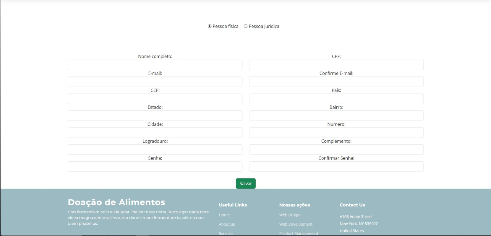
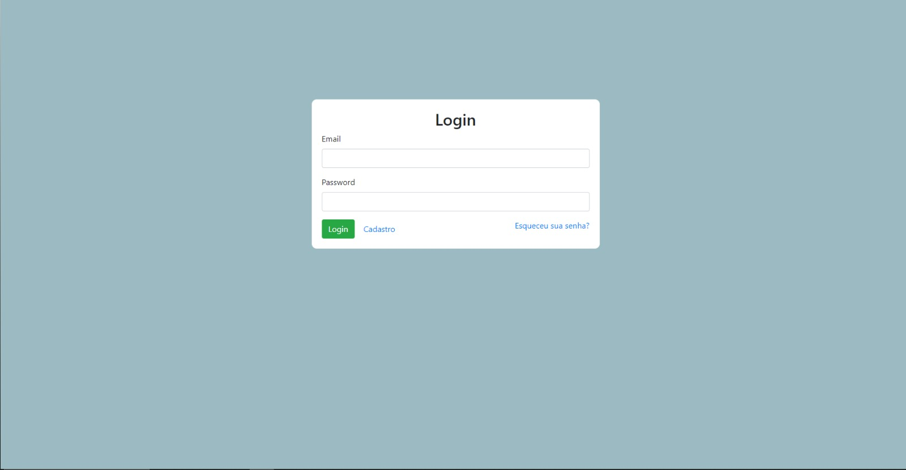

# Programação de Funcionalidades

### Tela de Cadastro (RF-01)

Responsável: Ítalo.

O acesso a tela de cadastro poderá ser feito através da opção na barra de navegação "Login" e depois em "Cadastro". As estruturas de dados foram baseadas em HTML, CSS , BOOTSTRAP e JS.

Exemplo da Tela de Cadastro:
<figure> 
  
  <figcaption> Figura 1 - Exemplo de Cadastro
</figure> 

#### Requisito atendido

RF-01: A aplicação deve permitir ao usuário cadastrar uma conta.

#### Artefatos da funcionalidade

●cadastro.html

●cadastro.js

●style.css

●main.css

●main.js

### Estrutura de Dados

●[cadastro.html](https://github.com/ICEI-PUC-Minas-PMV-ADS/pmv-ads-2024-e1-proj-web-t2-ads-e1-grupo2-doacao-de-alimentos/blob/main/codigo-fonte/cadastro/cadastro.html)

### Instruções de Acesso

Abra a URL da página em seu navegador. Ao clicar em "Login" no canto superior direito, irá abrir uma nova página onde você deve clicar no botão "cadastro" na página e será redirecionado para a página de cadastro.

### Tela de Login (RF-02)

Responsável: Ítalo.

O acesso a tela de login poderá ser feito através da opção na barra de navegação "Login". As estruturas de dados foram baseadas em HTML, CSS , BOOTSTRAP e JS.

Exemplo da Tela de Login:
<figure> 
  
  <figcaption> Figura 1 - Exemplo de Login
</figure> 

#### Requisito atendido

RF-02: A aplicação deve permitir ao usuário fazer o login da sua conta cadastrada.

#### Artefatos da funcionalidade

●login.html

●login.js

●main.css

●main.js

### Estrutura de Dados

●[login.html](https://github.com/ICEI-PUC-Minas-PMV-ADS/pmv-ads-2024-e1-proj-web-t2-ads-e1-grupo2-doacao-de-alimentos/blob/main/codigo-fonte/cadastro/login.html)

### Instruções de Acesso

Abra a URL da página em seu navegador. Ao clicar em "Login" no canto superior direito, irá abrir uma nova página onde você pode realizar o login.

