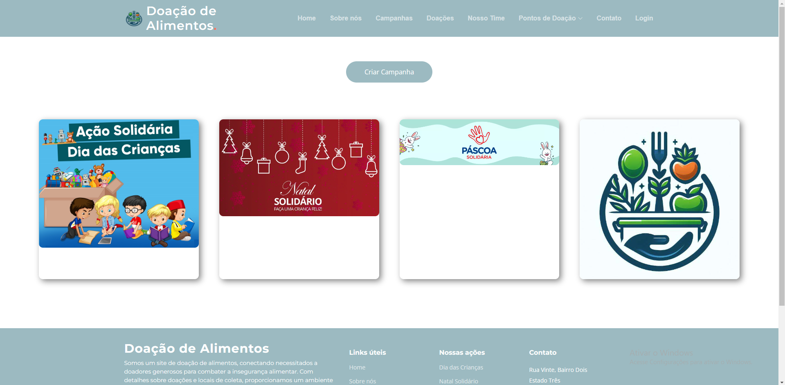

# Registro de Testes de Software

Pré-requisitos: <a href="3-Projeto de Interface.md"> Projeto de Interface</a>, <a href="8-Plano de Testes de Software.md"> Plano de Testes de Software</a>

Os testes funcionais realizados na aplicação web são descritos a seguir.

<ol>
  

  <li> CT-03: Verificar o funcionamento da parte de criação de campanhas.

  Responsável: Danilo

 
Visualizar as campanhas ativas:

 
Preencher as informações para cadastro de campanha:

 

 
Retornar para a página de campanhas e verificar se a campanha criada foi adicionada:

 

 
Colocando o cursor do mouse em cima da camoanha, é possível ver as ifnromações principais da campanha:

 
 

</li>

</ol>
