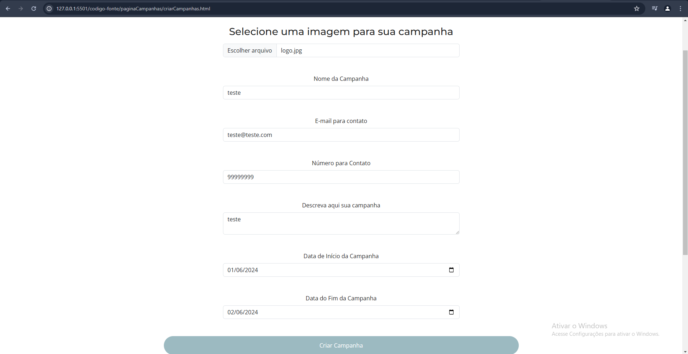
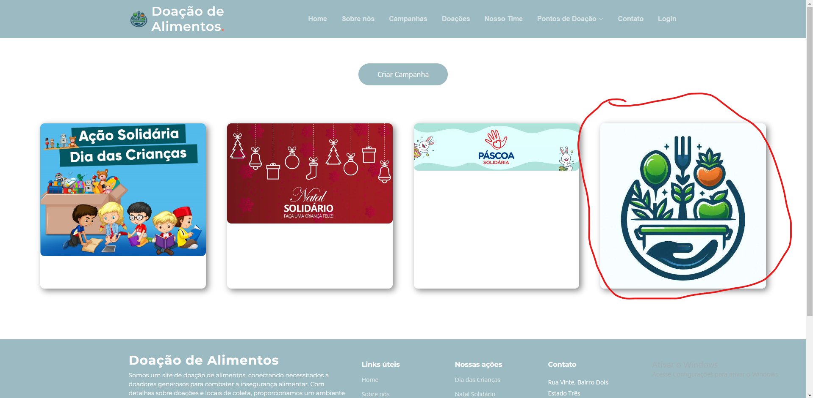
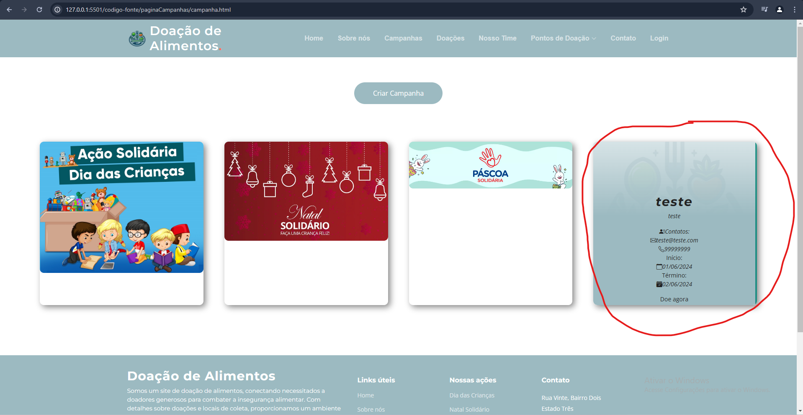
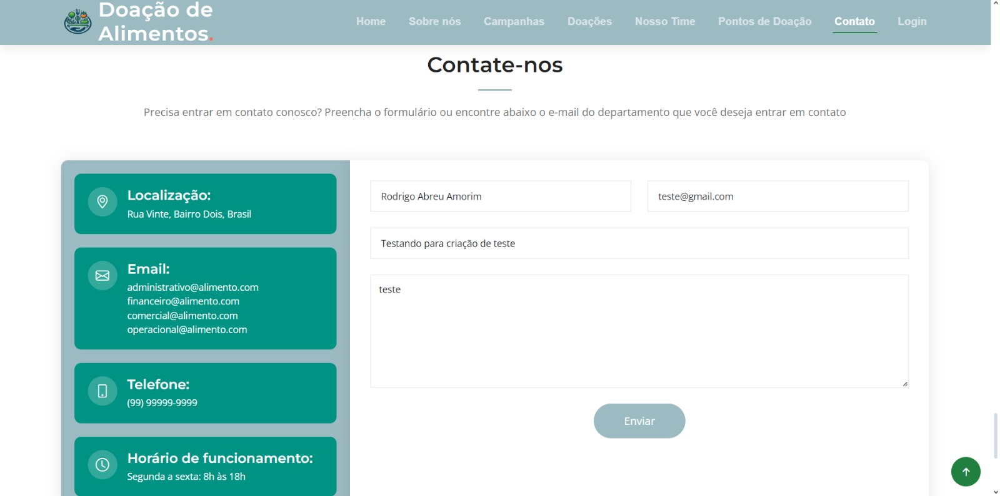
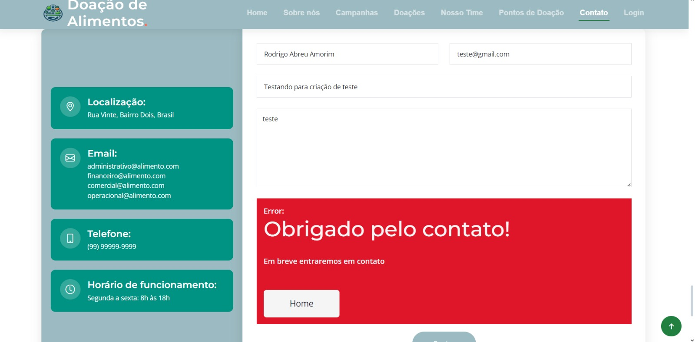

# Registro de Testes de Software

Pré-requisitos: <a href="3-Projeto de Interface.md"> Projeto de Interface</a>, <a href="8-Plano de Testes de Software.md"> Plano de Testes de Software</a>

Os testes funcionais realizados na aplicação web são descritos a seguir.

<ol>
  

  <li> CT-03: Verificar o funcionamento da parte de criação de campanhas.

    Responsável: Danilo

 
Visualizar as campanhas ativas:

 
Preencher as informações para cadastro de campanha:

 

 
Retornar para a página de campanhas e verificar se a campanha criada foi adicionada:

 

 
Colocando o cursor do mouse em cima da campanha, é possível ver as ifnromações principais da campanha:

 
 
 

 <li> CT-01: Verificar o funcionamento da parte de produtos na Home Page.

    Responsável: Rodrigo

  https://github.com/ICEI-PUC-Minas-PMV-ADS/pmv-ads-2024-e1-proj-web-t2-ads-e1-grupo2-doacao-de-alimentos/assets/123666533/1f48e720-6d6c-4a6c-b2e8-8cde3775f8a8

  </li>

   <li> CT-02: Verificar o funcionamento da parte de contatos na Home Page.

    Responsável: Rodrigo

  
Visualizar a parte de contato e preencher os campos requisitados:

  

  
Receber o FeedBack do contato e do preenchimento dos campos:

  

  
Recebimento do contato via E-mail:

  

  </li>

</li>

</ol>
